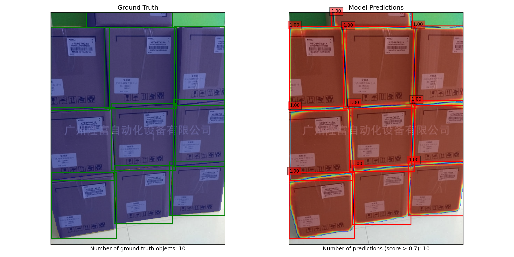

# Carton Instance Segmentation with Mask R-CNN



## Project Overview

This repository contains code for training and evaluating a [Mask R-CNN](https://github.com/matterport/Mask_RCNN) model to perform instance segmentation on cartons. The model can identify individual cartons in images, providing both bounding box detection and pixel-level segmentation masks. The implementation leverages transfer learning by using a pre-trained Mask R-CNN model with ResNet-50 backbone (initially trained on [COCO dataset](https://cocodataset.org/#home)) and fine-tuning it specifically for carton detection and segmentation.

## Features

- Custom dataset implementation for [LabelMe](https://github.com/wkentaro/labelme) polygon annotations form the [SCD: Stacked Carton Dataset](https://github.com/yancie-yjr/scd.github.io) for Detection and Segmentation
- Complete [Mask R-CNN](https://github.com/matterport/Mask_RCNN) implementation with ResNet-50 backbone
- Training and evaluation pipeline with TensorBoard integration
- Comprehensive evaluation metrics including mAP for both bounding boxes and segmentation masks
- Visualization tools for model predictions
- Support for experiment tracking across multiple training runs

## Installation

### Dependencies

- PyTorch 2.0+
- torchvision
- torchmetrics
- numpy
- scikit-image
- opencv-python
- matplotlib
- tqdm
- tensorboard
- pycocotools
- pyyaml

Install dependencies:
```bash
pip install -r requirements.txt
```

### Setup

```bash
# Clone the repository
git clone https://github.com/akashnaokar/Stacked_Carton_Segmentation.git
cd Stacked_Carton_Segmentation

# Create and activate a virtual environment (optional but recommended)
python3 -m venv venv
source venv/bin/activate  # On Windows: venv\Scripts\activate

# Install dependencies
pip install -r requirements.txt
```

## Dataset Structure

The dataset should be organized as follows:

```
carton_data/
└── labelme/
    ├── image1.jpg
    ├── image1.json
    ├── image2.jpg
    ├── image2.json
    └── ...
```

Where each `.json` file is a LabelMe annotation file corresponding to the image with the same name.

## Usage

### Training

To train the model:

```bash
python3 train.py
```

You can modify the configuration parameters in the `Config` class within `train.py` to adjust:
- Training hyperparameters (learning rate, batch size, epochs)
- Dataset settings (max samples, train/val ratio)
- Run number for tracking experiments
- Output directories

### Evaluation

To evaluate a trained model:

```bash
python3 inference.py
```

Adjust the `EvaluationConfig` in `inference.py` to specify which trained model to evaluate.

## Project Structure

- `data_loader.py`: Contains the dataset class and data loading utilities
- `model.py`: Defines the Mask R-CNN model and training/evaluation functions
- `train.py`: Main training script with configuration
- `inference.py`: Evaluation script for trained models
- `utils/` (implied from imports):
  - `visualization.py`: Tools for visualizing predictions
  - `evaluation_analysis.py`: Functions for analyzing model performance
  - `sequential_evaluation.py`: Alternative evaluation method for memory-constrained environments

## Training Workflow

1. **Data Preparation**: The dataset is loaded and split into training and validation sets.
2. **Model Initialization**: A Mask R-CNN model with ResNet-50 backbone is initialized, with the classification and mask heads modified for carton segmentation.
3. **Training Loop**: The model is trained for a specified number of epochs with SGD optimizer and learning rate scheduling.
4. **Checkpointing**: The best model based on validation loss is saved.
5. **Logging**: Training and validation metrics are logged to TensorBoard.

### Hyperparameters

Key hyperparameters in the default configuration:
- Learning rate: 0.005
- Batch size: 4
- Weight decay: 0.0005
- Momentum: 0.9
- LR scheduler: StepLR with step size 10 and gamma 0.2

## Evaluation Metrics

The evaluation process computes:
- Mean Average Precision (mAP) for bounding box detection
- Mean Average Precision (mAP) for segmentation masks
- Precision-recall curves and confusion matrices

## Results

Evaluation results are saved to the `evaluation_results` directory, including:
- JSON files with detailed metrics
- Visualizations of model predictions
- Analysis of prediction errors

## Customization

### Using Your Own Dataset

1. Prepare your dataset in LabelMe format
2. Update the `data_dir` path in the configuration
3. Modify the `class_map` in `CartonSegmentationDataset` if you have different classes

### Modifying the Model

To use a different backbone or model architecture:
- Update the `get_model_instance` function in `model.py`

## Troubleshooting

### Memory Issues

If you encounter CUDA out of memory errors:
- Reduce the batch size
- Use `max_samples` to limit the dataset size
- Try the sequential evaluation method which processes one sample at a time

### Multiprocessing Issues

If data loading is causing problems:
- Reduce the number of workers (`num_workers`)
- Set `torch.multiprocessing.set_sharing_strategy('file_system')`

## License

[Specify your license here]

## Acknowledgements

- This implementation uses PyTorch and torchvision's Mask R-CNN implementation
- [Any other acknowledgements]

## Citation

If you use this code in your research, please cite:

```
@software{carton_segmentation,
  author = {Akash Naokar},
  title = {Carton Instance Segmentation},
  year = {2025},
  url = {https://github.com/akashnaokar/Stacked_Carton_Segmentation.git}
}
```